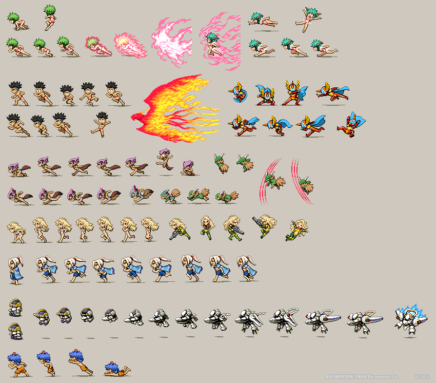
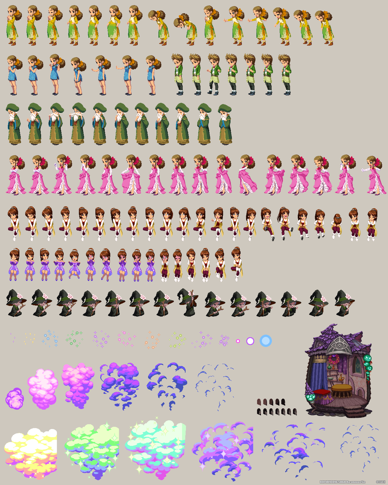
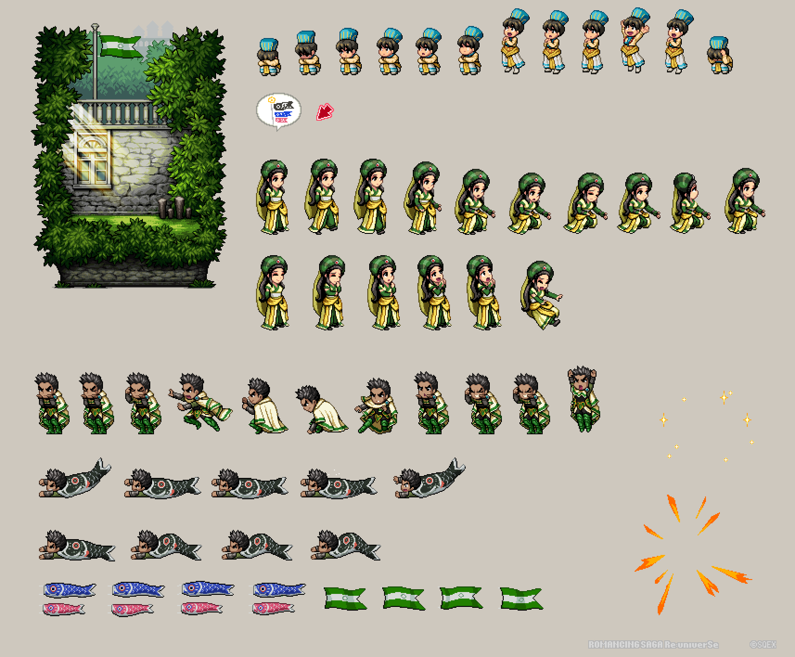
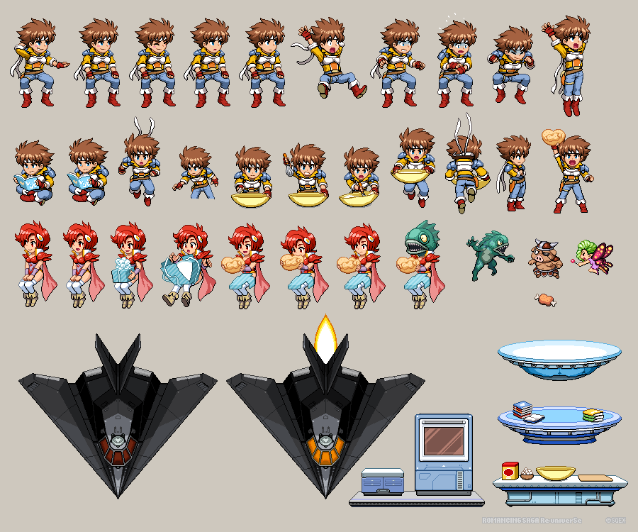
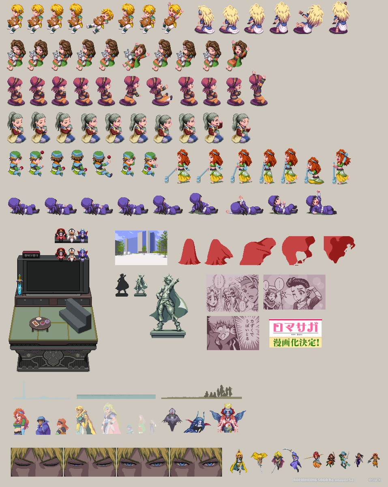

## SpriteSheet

A veces interesa tener todos los frames de las animaciones en una misma imagen
Se le denomina SpriteSheet

### Ejemplos de M.Nishimura @hectNishi

[Ejemplo de animación](https://twitter.com/hectNishi/status/1257754099266629632)

[Gif simple de ejemplo](https://twitter.com/hectNishi/status/1264341827416518656)

### Recursos

[Clase para manejar SpriteSheet](https://www.pygame.org/wiki/Spritesheet)

[Simple spriteSheet	](https://www.sourcecodester.com/tutorials/python/11879/python-pygame-simple-spritesheet-animation.html) [Código e imágenes](https://www.sourcecodester.com/download-code?nid=11879&title=Python+-+Pygame+Simple+SpriteSheet+Animation&uri=%2Ftutorials%2Fpython%2F11879%2Fpython-pygame-simple-spritesheet-animation.html) [En local](./python_-_pygame_spritesheet_animation.zip)

[Tutorial animacion basico](https://techwithtim.net/tutorials/game-development-with-python/pygame-tutorial/pygame-animation/)

[Generador de spriteSheet](https://ya-webdesign.com/image/sprite-png-generator/2054178.html)

[Tutorial](https://pythonprogramming.altervista.org/animation-on-pygame-2-free-characters-and-more-actions/)

[Free assets (recursos)](https://www.gameart2d.com/freebies.html)
